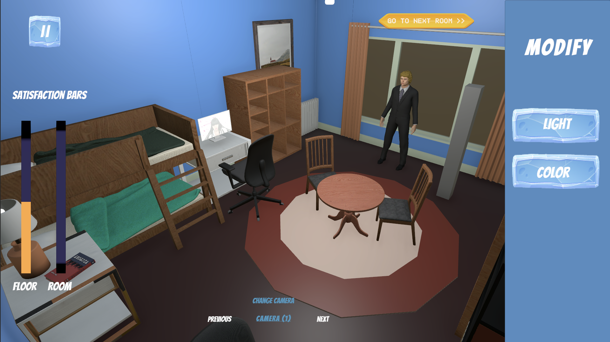

# Polar Design : Concordia Architecture Simulator

# Polar Design : Concordia Architecture Simulator

## Présentation

**Polar Design** est un *Serious Game* développé avec **Unity** qui explore l’impact de l’architecture et du design d’intérieur sur la psychologie humaine en milieu extrême.

Le joueur est chargé de l’aménagement de la base scientifique **Concordia**, située en Antarctique. Dans cet environnement dit **ICE** (*Isolé, Confiné, Extrême*), chaque choix de design influence directement le **moral**, le **niveau de stress** et la **cohésion sociale** de l’équipe de recherche.

---

## Contexte scientifique

Vivre en autarcie totale à Concordia pendant plusieurs mois impose des défis majeurs à la santé mentale :

* **Isolation sensorielle** due au paysage monotone
* **Absence de cycle jour/nuit naturel** (nuit polaire)
* **Promiscuité** dans des espaces restreints

Ce projet démontre comment le design peut atténuer ces effets via :

* **L’éclairage circadien** (ajustement de la température et de l’intensité)
* **La psychologie des couleurs** (palettes adaptées à la fonction des pièces)
* **L’ergonomie** (choix du mobilier et gestion de l’encombrement)

---

## Architecture technique & design patterns

Le projet repose sur une architecture modulaire utilisant des patrons de conception afin d’assurer le découplage des systèmes et la maintenabilité du code.

* **Strategy & Factory**
  Gestion dynamique du chargement des scènes. Selon la tour sélectionnée (*Calm* ou *Noisy*), une stratégie définit les pièces accessibles.

* **Observer**
  L’`EventManager` centralise les événements. L’UI communique avec les objets 3D (lampes, meubles, murs) sans dépendances directes.

* **Command**
  Utilisé pour le système audio. Les feedbacks sonores sont déclenchés via l’`AudioManager` de manière centralisée.

* **Navigation Stack**
  Le `NavigationManager` utilise une pile pour gérer l’historique des menus et des scènes (fonctionnalité de retour).

---

## Fonctionnalités principales

### Système de décoration & mobilier

* **Interaction 3D** : sélection directe des meubles par clic (`FurnitureSelector`)
* **Variantes & scores** : chaque meuble propose 4 variantes influençant :

  * Design
  * Usure
  * Goût

### Gestion de l’éclairage

* **Contrôle circadien** : réglage de l’intensité et basculement entre lumière chaude (confort) et froide (travail)
* **Profils contextuels** : utilisation de `ScriptableObjects` (`LightIntensityProfile`) définissant des bonus si l’intensité est adaptée au type de pièce

### Personnalisation chromatique

* **Matériaux dynamiques** : modification des textures des murs et des sols
* **Scores contextuels** : impact variable selon la fonction de la pièce (ex. : bleu apaisant dans une chambre, blanc stimulant dans un laboratoire)

### Moteur de satisfaction

* **Calcul en temps réel** : le `RoomManager` agrège les scores de tous les systèmes
* **Progression globale** : le `GameSessionManager` calcule la satisfaction moyenne d’un étage complet

---
## Téléchargement et Documentation
Afin de savoir comment télécharger et installer le jeu cliquez <a href="https://git.unistra.fr/t3-milkalcoholics/t3-sci25b-t3-a/-/blob/main/Install.md?ref_type=heads">ici</a>

Pour plus d'information sur le jeu consultez ce <a href="https://git.unistra.fr/t3-milkalcoholics/t3-sci25b-t3-a/-/blob/main/Description.md?ref_type=heads">lien</a>

---

## Utilisation & contrôles

* **Clic gauche** : sélectionner un objet 3D ou un bouton UI
* **Clic gauche** sur les bouton de changement de camera pour changer de camera
* **Panneaux UI** : ajuster les paramètres et valider pour passer à la pièce suivante

---

## Technologies utilisées

* **Unity 2022.x+ (LTS recommandé)**
* **C#** (Programmation Orientée Objet)
* **Universal Render Pipeline (URP)**
* **New Input System**
* **ScriptableObjects** (configuration des données)

---

## Licence

Ce projet est sous licence **MIT**.
Voir le fichier <a href="https://git.unistra.fr/t3-milkalcoholics/t3-sci25b-t3-a/-/blob/eb97f2b6e4f0a2d6a38ecbbd7828122ec1049d58/LICENSE">`LICENSE`</a> pour plus d’informations.

---

### Note

Ce projet a une vocation **scientifique**, **pédagogique** et **exploratoire**, orientée vers l’étude du design environnemental et de la psychologie humaine en milieu extrême.

